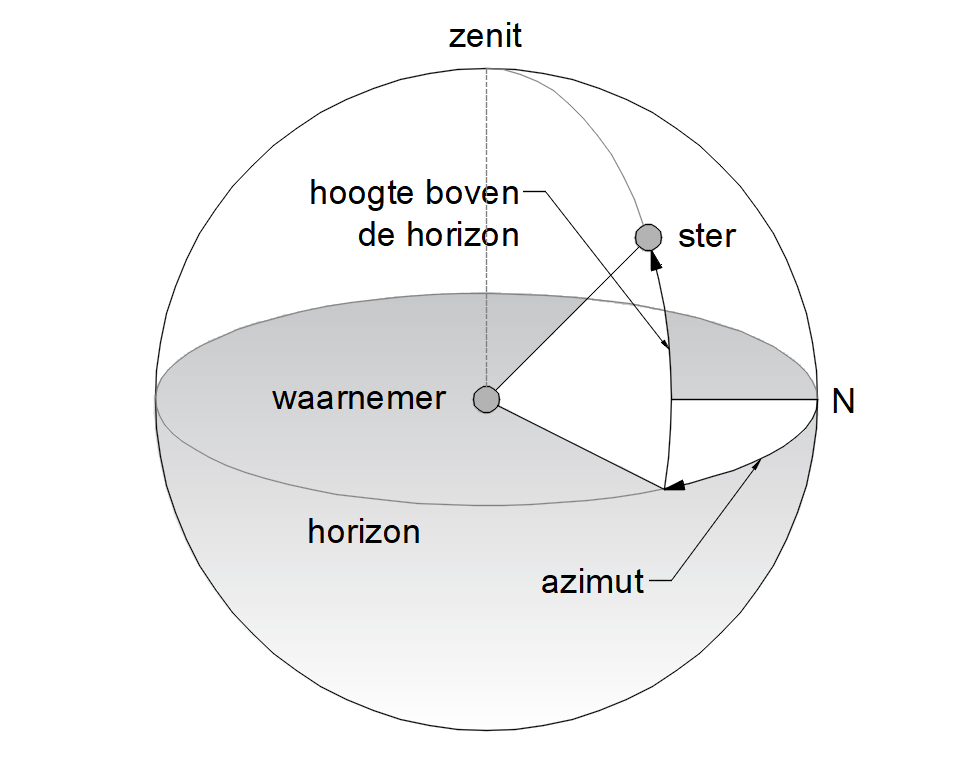

### Azimut
Uit [Wikipedia](https://nl.wikipedia.org/wiki/Azimut), de vrije encyclopedie

Het **azimut** is een van de coördinaten uit het horizontale-coördinatenstelsel. In dit stelsel wordt de positie van een object aan de [hemel](https://nl.wikipedia.org/wiki/Hemelgewelf) aangegeven door de twee coördinaten: azimut en [elevatie](https://nl.wikipedia.org/wiki/Hoogte_(astronomie)). Het azimut is daarin de [horizontale](https://nl.wikipedia.org/wiki/Horizontaal) component, de [kompasrichting](https://nl.wikipedia.org/wiki/Richting#Absolute_richting), dus de [hoek](https://nl.wikipedia.org/wiki/Hoek_(meetkunde)) met het [noorden](https://nl.wikipedia.org/wiki/Noord_(windstreek)) gemeten over het [oosten](https://nl.wikipedia.org/wiki/Oost_(windstreek)) en komt dus met het [argument, dat in de landmeetkunde wordt gebruikt](https://nl.wikipedia.org/wiki/Argument_(landmeetkunde)), overeen. Gewoonlijk wordt het azimut in [graden](https://nl.wikipedia.org/wiki/Booggraad) uitgedrukt.

De positie van een ster aan de hemel wordt dus aangegeven door het azimut: de kompasrichting, en de hoogte: de hoek tussen de ster en de horizon. De gehele cirkel is 360°, noord=0°, oost=90°, zuid=180°, west=270°

Het azimut van een [hemellichaam](https://nl.wikipedia.org/wiki/Hemellichaam) bijvoorbeeld komt overeen met de kompasrichting waarin dat hemellichaam wordt waargenomen. Het is de hoek tussen het noordpunt en het [snijpunt](https://nl.wikipedia.org/wiki/Snijpunt) van de horizon met het [meridiaanvlak](https://nl.wikipedia.org/wiki/Meridiaan_(geografie)) die door het hemellichaam loopt, gemeten in de richting vanuit noord naar oost en wordt uitgedrukt in graden.

Als voorbeeld: een [ster](https://nl.wikipedia.org/wiki/Ster_(hemellichaam)) die zich precies in het oosten bevindt heeft een azimut van 90°.

### Cartografie

Het cartografische azimut 𝑎𝑧 van een bepaalde richting, in [decimale graden](https://nl.wikipedia.org/wiki/Decimale_graad), kan ook worden berekend als de coördinaten (𝑥1,𝑦1) en (𝑥2,𝑦2) van twee punten in een plat vlak bekend zijn. De positieve x-as wijst naar het oosten en de positieve y-as naar het noorden. In [cartografische coördinaten](https://nl.wikipedia.org/wiki/Geodetisch_coördinatensysteem) is:

$$𝑎𝑧=180\pi \space arctan⁡(𝑥2−𝑥1,𝑦2−𝑦1)$$

Merk hierbij op dat de referentieassen ten opzichte van het linksdraaiende [goniometrische assenstelsel](https://nl.wikipedia.org/wiki/Poolcoördinaten) zijn omgewisseld en dat het azimut rechtsdraaiend is ten opzichte van het noorden. Als een azimut negatief is mag men er 360° bijtellen.

In [radialen](https://nl.wikipedia.org/wiki/Radiaal_(wiskunde)) zou de formule iets eenvoudiger zijn:

$$𝑎𝑧=arctan⁡(𝑥2−𝑥1,𝑦2−𝑦1)$$

Sommige [platformen](https://nl.wikipedia.org/wiki/Platform_(informatica)) draaien de volgorde van de [arctangens](https://nl.wikipedia.org/wiki/Arctangens) om, wat tot vreemde resultaten kan leiden.